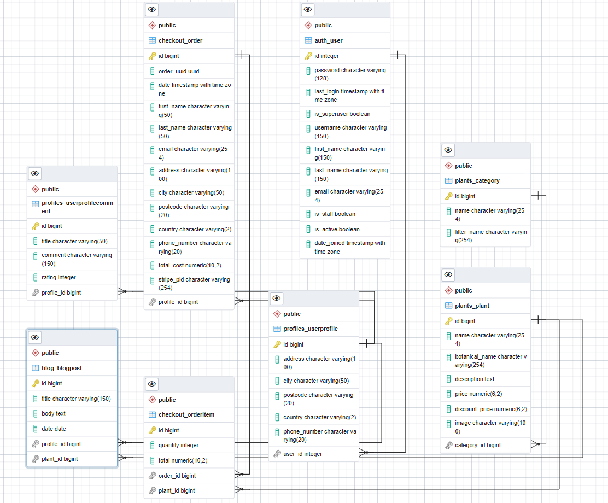

# Julia's Plants

[Julia's Plants](https://juliasplants.herokuapp.com) is the site to visit if you want to make your home a little greener.

We have a wide selection of high quality plants for sale.

Create an account and get access to discounts on selected plants!

Welcome to [Julia's Plants](https://juliasplants.herokuapp.com)!

## Table of Contents

1. [UX](#ux)
    - [User Stories](#user-stories)
    - [Business Goals](#business-goals)
    - [Design](#design)
        - [Colours](#colours)
        - [Fonts](#fonts)
    - [Wireframes](#wireframes)
2. [Features](#features)
    - [Existing Features](#existing-features)
    - [Upcoming Features](#upcoming-features)
3. [Technologies Used](#technologies-used)
    - [Languages Used](#languages-used)
    - [Frameworks, Libraries and Software Used](#frameworks-libraries-and-software-used)
4. [Data Model](#data-model)
5. [Test](#test)
    - [Validation Services](TEST.md#validation-services)
        - [W3C Markup Validation Service](TEST.md#w3c-markup-validation-service)
        - [W3C CSS Validation Service](TEST.md#w3c-css-validation-service)
        - [JSHint](TEST.md#jshint)
        - [PEP8 Online](TEST.md#pep8-online)
    - [Testing User Stories](TEST.md#testing-user-stories)
        - [Common Users](TEST.md#common-users)
        - [Unregistered Users](TEST.md#unregistered-users)
        - [Registered Users](TEST.md#registered-users)
        - [Administrator Users](TEST.md#administrator-users)
    - [Further Testing](TEST.md#further-testing)
6. [Deployment](#deployment)
7. [Credits](#credits)
    - [Code](#code)
    - [Content](#content)
    - [Media](#media)
        - [Images](#images)
    - [Acknowledgements](#acknowledgements)

## UX

### User Stories

| As a/an               | I want to be able to...                                        | So that I can...                                                                  |
| :-------------------- | :------------------------------------------------------------- | :-------------------------------------------------------------------------------- |
| Unregistered Customer | Clearly see the benefits registered customers are entitled to  | Decide if I should register for an account                                        |
| Unregistered Customer | Register for an account                                        | Use the benefits that customers with a registered account have access to          |
| Registered Customer   | Have a personal profile page                                   | See my order history and update my contact, payment and delivery information      |
| Registered Customer   | Write a review of my experience of the site                    | Give feedback and possibly suggest improvements                                   |
| Registered Customer   | Log in and log out                                             | Gain access to my personal profile page                                           |
| Registered Customer   | Have my payment and delivery information prefilled at checkout | Easily make a purchase                                                            |
| Registered Customer   | Reset my password if I forget it                               | Regain access to my account                                                       |
| Customer              | See an overview of which plants are for sale                   | Decide if I should make a purchase                                                |
| Customer              | Clearly see which plants are currently discounted              | Decide if I should sign up for an account and potentially save money              |
| Customer              | Filter by category or currently discounted plants              | Easily find the plant I am looking for                                            |
| Customer              | Sort the plants by name, price or category                     | Easily find the plant I am looking for                                            |
| Customer              | Search for a specific plant by name, description or category   | Easily find the plant I am looking for                                            |
| Customer              | Click on a plant                                               | See plant details and add the desired quantity to the shopping cart               |
| Customer              | Read customer reviews                                          | Decide if this is a good site to buy plants from                                  |
| Customer              | Navigate to the shopping cart                                  | See the cost, remove a plant, update the quantity or proceed to checkout          |
| Customer              | See an order confirmation after a purchase                     | See details of my purchase                                                        |
| Customer              | Receive an order confirmation by email after a purchase        | See details about my purchase and have the information stored in a separate place |
| Customer              | Read about plant care tips                                     | Make my plants live longer                                                        |
| Site Admin            | Add new plants to the site                                     | Make sure new plants are displayed on the site                                    |
| Site Admin            | Update information for existing plants                         | Make sure that the correct information about the plants is displayed on the site  |
| Site Admin            | Delete a plant                                                 | Make sure that plants that are no longer for sale are removed from the site       |
| Site Admin            | Make blog posts about plant care tips                          | Share knowledge and avoid plant returns                                           |

### Business Goals

- Have a user-friendly and beautiful website where it is easy to purchase plants.
- Increase profitability by not having any physical stores.
- Have a large customer base by having very favorable prices for registered customers.
- Offer high-quality plants and reliable deliveries to increase the customer base.
- Have a varied selection of plants for sale.
- Ensure that customer support is fast and of high quality.

### Design

#### Colours

- The colours used on the site are inherited from the Bootstrap framework.

#### Fonts

- The Nunito font is used for navigation links, headings, forms, tables, buttons and text content.

### Wireframes

- [Home](readme/wireframes/home.pdf)
- [Register](readme/wireframes/register.pdf)
- [Login](readme/wireframes/login.pdf)
- [Plants](readme/wireframes/plants.pdf)
- [Plant Details](readme/wireframes/plant_details.pdf)
- [Add/Edit Plant](readme/wireframes/add_edit_plant.pdf)
- [Shopping Cart](readme/wireframes/shopping_cart.pdf)
- [Checkout](readme/wireframes/checkout.pdf)
- [Order Confirmation](readme/wireframes/order_confirmation.pdf)
- [My Profile](readme/wireframes/my_profile.pdf)
- [Footer/Reviews](readme/wireframes/footer_reviews.pdf)
- [Blog](readme/wireframes/blog.pdf)
- [Blog Post](readme/wireframes/blog_post.pdf)
- [Add/Edit Blog Post](readme/wireframes/add_edit_blog_post.pdf)

## Features

### Existing Features

- All customers can see a clear overview of which plants are for sale.
- All customers can clearly see which plants are currently discounted.
- All customers can filter by category or currently discounted plants.
- All customers can sort the plants by name, price or category.
- All customers can search for a specific plant by name, description or category.
- All customers can click on a plant to see details.
- All customers can add a plant to the shopping cart.
- All customers can navigate to the shopping cart to see the current cost.
- All customers can navigate to the shopping cart and remove a plant or update the quantity.
- All customers can navigate to the shopping cart and proceed to checkout.
- All customers will see an order confirmation after a purchase.
- All customers will receive an order confirmation by email after a purchase.
- All customers can read about the benefits of registering an account.
- Unregistered customers can register for an account.
- Registered customers can log in to see their profile page.
- Registered customers can see their order history and update their contact, payment and delivery information.
- Registered customers can log out.
- Registered customers can have their payment and delivery information prefilled at checkout.
- Registered customers can reset their password if they forget it.
- A site admin can add new plants to the site.
- A site admin can update information for existing plants.
- A site admin can delete a plant.

### Upcoming Features

- None at the moment.

## Technologies Used

### Languages Used

- [HTML5](https://en.wikipedia.org/wiki/HTML5)
- [CSS3](https://en.wikipedia.org/wiki/CSS)
- [JavaScript](https://en.wikipedia.org/wiki/JavaScript)
- [Python](https://en.wikipedia.org/wiki/Python_(programming_language))

### Frameworks, Libraries and Software Used

- [Django 3.2.8](https://www.djangoproject.com/)
    - The website has been created using the Django framework.
- [Stripe](https://stripe.com/)
    - Stripe is used for the payment functionality.
- [pgAdmin 4](https://www.pgadmin.org/)
    - The entity relationship diagram was created with pgAdmin 4.
- [Bootstrap 5.1.3](https://getbootstrap.com/docs/5.0/getting-started/introduction/)
    - The Bootstrap 5.0.2 framework is widely used in this project.
    - Code for the grid system, navigation bar, forms, tables and cards have been copied and later modified to suit this project.
- [jQuery 3.6.0](https://jquery.com/)
    - jQuery is used in all JavaScript files.
- [Git](https://git-scm.com/)
    - Git is used for version control of the code in the project.
- [Github](https://github.com/)
    - The files for this project are stored in GitHub.
- [Gitpod](https://gitpod.io/)
    - Gitpod has been used as a development environment for this project.
- [Heroku](https://www.heroku.com/)
    - The production version of the website is hosted on Heroku.
- [Amazon Web Services](https://aws.amazon.com/)
    - AWS is used for the storage of static and media files.
- [Balsamiq](https://balsamiq.com/)
    - Balsamiq was used to create wireframes for this project.
- [Google Fonts](https://fonts.google.com/)
    - The fonts used on the website are imported from Google Fonts.
- [Font Awesome](https://fontawesome.com/)
    - Icons from Font Awesome can be seen on the site.
- [favicon.io](https://favicon.io/)
    - The favicon used on the website was obtained from [favicon.io](https://favicon.io/emoji-favicons/potted-plant/).
- [Chrome DevTools](https://developer.chrome.com/docs/devtools/)
    - Chrome DevTools was used extensively during the development of the website.

## Data Model

- Entity Relationship Diagram

    

## Test

- Tests performed are documented in [TEST.md](TEST.md).

## Deployment

## Credits

### Code

- The payment functionality is highly inspired by the Django mini project developed by [Code Institute](https://codeinstitute.net/).
- The sort and search functionality is highly inspired by the Django mini project developed by [Code Institute](https://codeinstitute.net/).
- The tip for the range template tag was found in this [Stack Overflow](https://codeinstitute.net/) post.
- The tip for rendering the active navbar links was found in this [Stack Overflow](https://stackoverflow.com/a/27379100) post.
- The tip for making the card images the same size was found in this [Stack Overflow](https://stackoverflow.com/a/54207386) post.

### Content

- The information about the benjamin fig was copied from [Wikipedia](https://en.wikipedia.org/wiki/Ficus_benjamina).
- The information about the spider plant was copied from [Wikipedia](https://en.wikipedia.org/wiki/Chlorophytum_comosum).
- The information about the cactus was copied from [Wikipedia](https://en.wikipedia.org/wiki/Turbinicarpus).
- The information about the thyme was copied from [Wikipedia](https://en.wikipedia.org/wiki/Thyme).
- The information about the rose was copied from [Wikipedia](https://en.wikipedia.org/wiki/Rose).
- The information about the basil was copied from [Wikipedia](https://en.wikipedia.org/wiki/Basil).

### Media

#### Images

- The background image on the home page was obtained from [Scott Webb on Pixabay](https://pixabay.com/photos/plant-succulent-potted-white-space-2004483/).
- The image of the benjamin fig was obtained from [KENPEI on Wikipedia](https://commons.wikimedia.org/wiki/File:Ficus_benjamina2.jpg).
- The image of the spider plant was obtained from [Peter Coxhead on Wikipedia](https://commons.wikimedia.org/wiki/File:Hierbabuena_0611_Revised.jpg).
- The image of the cactus was obtained from [Michael Wolf on Wikipedia](https://commons.wikimedia.org/wiki/File:Turbinicarpus_knuthianus.jpg).
- The image of the thyme was obtained from [Henry Brisse on Wikipedia](https://commons.wikimedia.org/wiki/File:Thymus_vulgaris1.JPG).
- The image of the roses was obtained from [Jebulon on Wikipedia](https://commons.wikimedia.org/wiki/File:Bouquet_de_roses_roses.jpg).
- The image of the basil was obtained from [Castielli on Wikipedia](https://commons.wikimedia.org/wiki/File:Basil-Basilico-Ocimum_basilicum-albahaca.jpg).

### Acknowledgements

- My Code Institute mentor Gerard McBride for valuable feedback.