# Julia's Plants

## Table of Contents

1. [Test](#test)
    - [Validation Services](#validation-services)
        - [W3C Markup Validation Service](#w3c-markup-validation-service)
        - [W3C CSS Validation Service](#w3c-css-validation-service)
        - [JSHint](#jshint)
        - [Pylint](#pylint)
    - [Testing User Stories](#testing-user-stories)
    - [Unit Tests](#unit-tests)
    - [Further Testing](#further-testing)
    - [Known Bugs](#known-bugs)
        - [Fixed](#fixed)
        - [Unfixed](#unfixed)

## Test

### Validation Services

#### [W3C Markup Validation Service](https://validator.w3.org/)

- The pages with login requirement were validated by copying the rendered HTML code from Chrome DevTools and pasting it into the validator.
- All other pages were validated by URI. 
- The validation tool reported no errors or warnings on the code written by the developer.

#### [W3C CSS Validation Service](https://jigsaw.w3.org/css-validator/)

- The CSS code was validated using direct input mode.
- The validation tool reported no errors after checking the CSS code.

#### [JSHint](https://jshint.com/)

- JSHint did not report any errors or warnings when validating the JavaScript code.
- JSHint was configured with the following settings during validation.

    ```
    /* jshint esversion: 8 */ 
    /* globals $:false, Stripe */
    ```

#### [Pylint](https://pylint.org/)

- Pylint was configured with the following settings during development.

    ```
   "python.linting.pylintArgs": [
      "--load-plugins",
      "pylint_django",
      "--django-settings-module=juliasplants.settings",
      "--disable=C0111",
      "--disable=W0223"
   ],
    ```
- No PEP8 violations are present in the code written by the developer.

### Testing User Stories
                             
- As an unregistered customer, I want to be able to clearly see the benefits registered customers are entitled to.
- As an unregistered customer, I want to be able to register for an account.
    - Information about benefits and registration can be seen on the home page.

    

- As a registered customer, I want to be able to have a personal profile page.
- As a registered customer, I want to be able to write a review of my experience of the site.
    - On the profile page, the user can update their contact information.
    - The user also has the option to submit a review.

    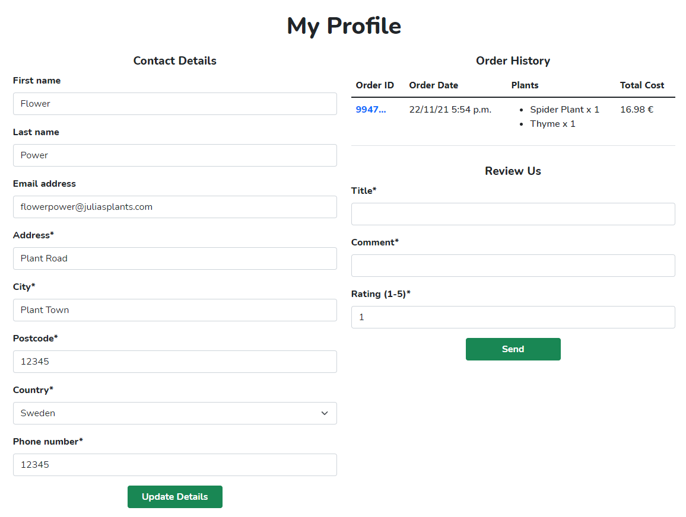

- As a registered customer, I want to be able to log in and log out.
- As a registered customer, I want to be able to reset my password if I forget it.
    - Login and logout buttons are located in the navigation bar.
    - Password reset options are also available.

    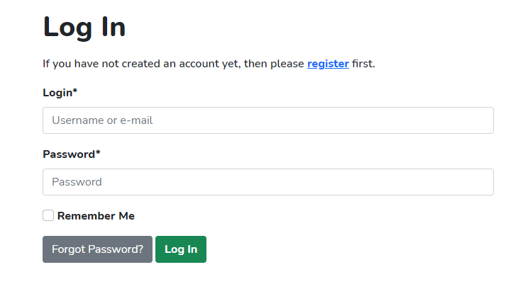
    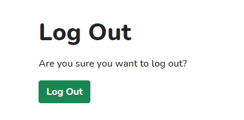

- As a registered customer, I want to be able to have my payment and delivery information prefilled at checkout.
    - Profile information is filled in automatically at checkout.

    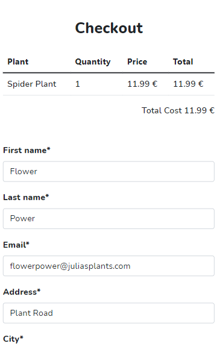

- As a customer, I want to be able to see an overview of which plants are for sale.
- As a customer, I want to be able to clearly see which plants are currently discounted.
- As a customer, I want to be able to filter by category or currently discounted plants.
- As a customer, I want to be able to sort the plants by name, price or category.
- As a customer, I want to be able to search for a specific plant by name, description or category.
    - The overview clearly shows which plants are for sale and whether they are discounted.
    - The user can sort, filter and search for plants.

    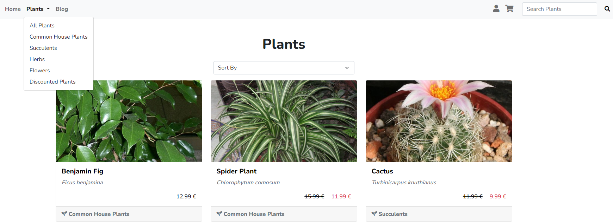

- As a customer, I want to be able to click on a plant to see details.
    - Each plant has a dedicated page with additional information.

    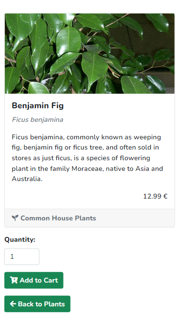

- As a customer, I want to be able to read customer reviews.
    - User reviews can be seen in the footer on the plants page.

    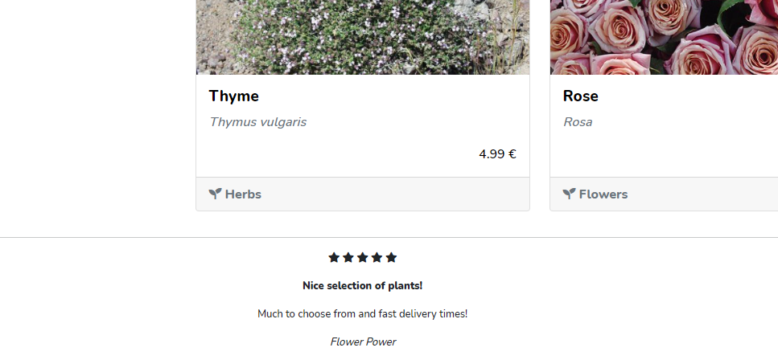

- As a customer, I want to be able to navigate to the shopping cart.
    - A link to the shopping cart is located in the navigation bar.

    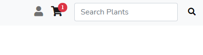

- As a customer, I want to be able to see an order confirmation after a purchase.
- As a customer, I want to be able to receive an order confirmation by email after a purchase.
    - An order confirmation page is always shown after a successful checkout.
    - The order confirmation is also sent by email.

    
    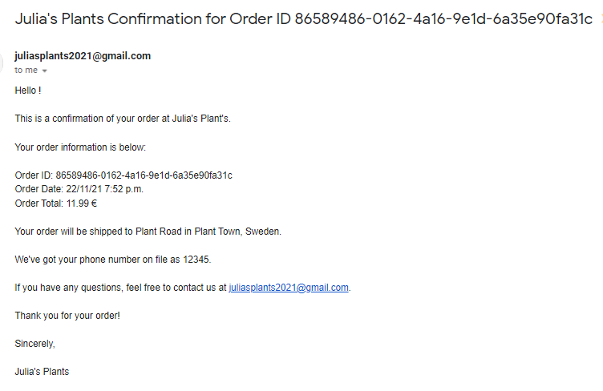

- As a customer, I want to be able to read about plant care tips.
    - Plant care tips can be found on the blog page.

    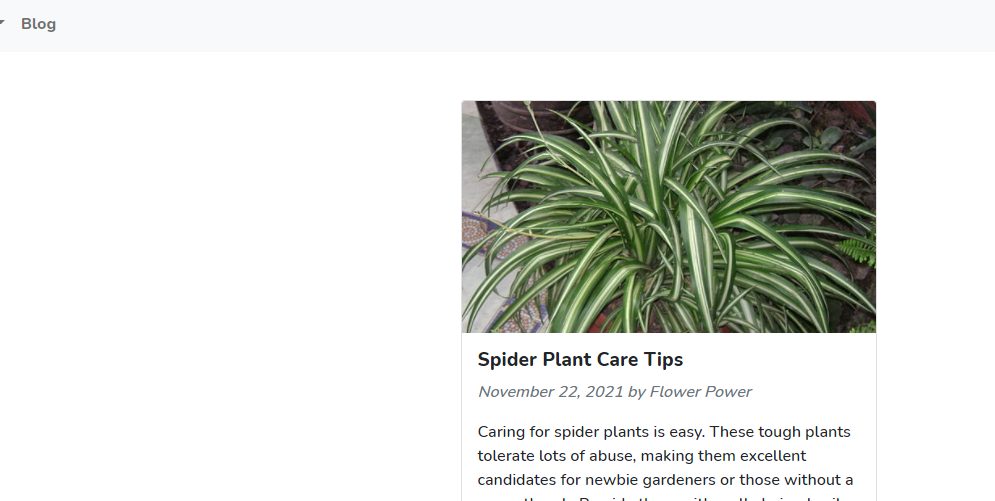

- As a site admin, I want to be able to add new plants to the site.
- As a site admin, I want to be able to update information for existing plants.
- As a site admin, I want to be able to delete a plant.
    - Forms for adding, editing and deleting plants are available for site admins.

    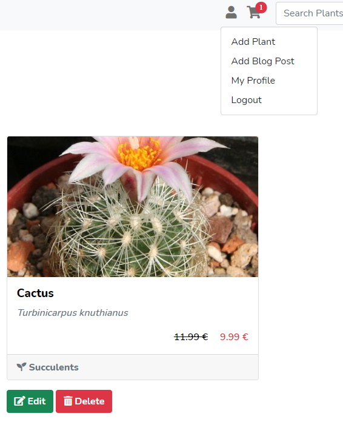
    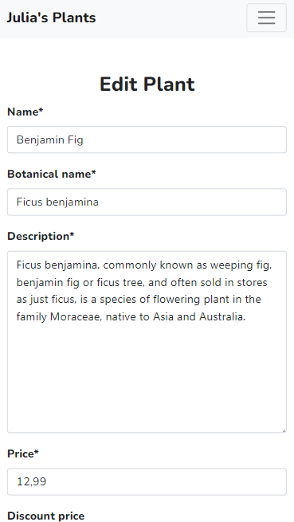

- As a site admin, I want to be able to make blog posts about plant care tips.
    - A form for adding blog posts is available for site admins.
    - The link to the form is located in the navigation bar.

    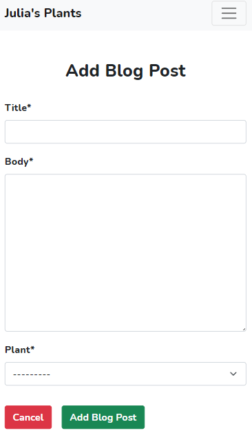

### Unit Tests

- Basic unit tests for some of the views have been created.
- The tests assert whether HTTP status code 200 and the correct template are returned.
- More unit tests will be added in a later release.

### Further Testing

- Testing of the website has been performed with Google Chrome, Microsoft Edge and Mozilla Firefox.

### Known Bugs

#### Fixed

- An error was displayed when trying to reach the checkout page without items in the cart. If the cart is empty the user is redirected back to the shopping cart.

#### Unfixed

- It is currently not mandatory to fill in the first and last name on the profile page. This could mean that the creator of reviews and blog posts is displayed as an empty string.

Back to main [README](README.md) file.